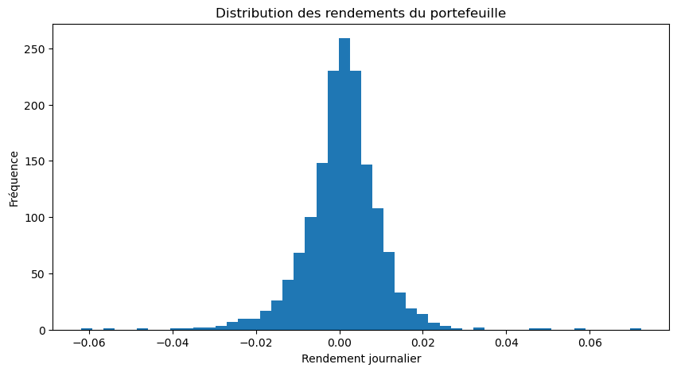
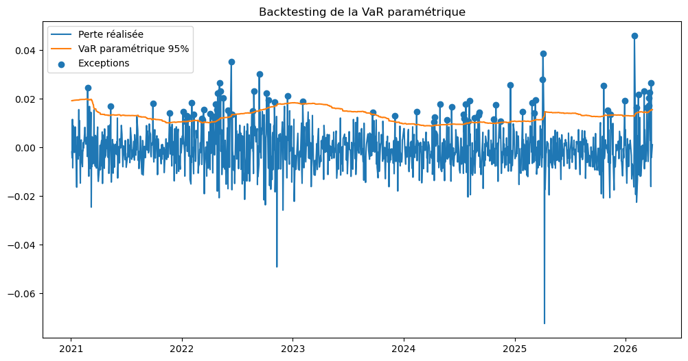
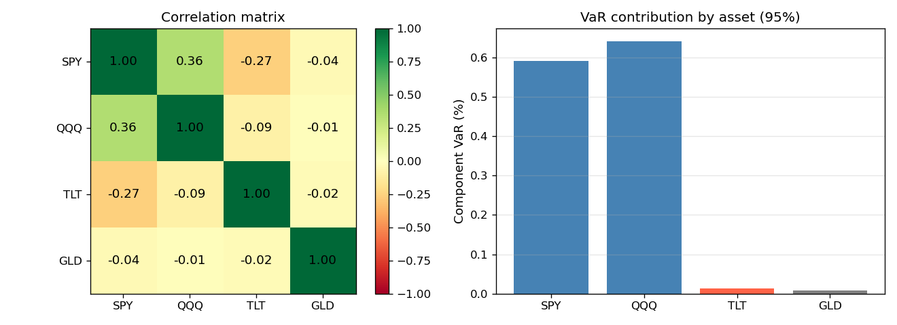

# Portfolio Risk — VaR, Expected Shortfall & Backtesting

Python project for market risk measurement applied to a diversified ETF portfolio.

---

## What this project does

Implements and compares three risk measures at 95% confidence level:

| Measure | Method | Assumption |
|---------|--------|------------|
| Historical VaR | Empirical quantile | Distribution-free |
| Parametric VaR | Normal distribution | Gaussian returns |
| Expected Shortfall (ES) | Mean of tail losses | Distribution-free |

Includes a **rolling-window backtest** to assess VaR accuracy over time.

---

## Portfolio

Four ETFs covering different asset classes:

| Ticker | Asset class | Weight |
|--------|-------------|--------|
| SPY | US equities | 40% |
| QQQ | Tech / Nasdaq | 30% |
| TLT | Long-term bonds | 20% |
| GLD | Gold | 10% |

---

## Installation

```bash
git clone https://github.com/mezaouifinance/portfolio-risk-VAR-ES.git
cd portfolio-risk-VAR-ES
pip install -r requirements.txt
```

---

## Usage

Open the notebook:

```bash
jupyter notebook notebook/risk_analysis.ipynb
```

Or use the modules directly:

```python
from src.data_loader import load_prices, compute_returns
from src.portfolio import portfolio_returns
from src.risk_metrics import historical_var, parametric_var, expected_shortfall
from src.backtesting import rolling_var_backtest, exception_rate

prices  = load_prices(["SPY", "QQQ", "TLT", "GLD"], start="2020-01-01")
returns = compute_returns(prices)
pf      = portfolio_returns(returns, weights=[0.4, 0.3, 0.2, 0.1])

print(f"Historical VaR (95%): {historical_var(pf):.2%}")
print(f"Parametric VaR (95%): {parametric_var(pf):.2%}")
print(f"Expected Shortfall:   {expected_shortfall(pf):.2%}")

backtest = rolling_var_backtest(pf, window=252, method="historical")
print(f"Exception rate: {exception_rate(backtest):.2%}  (expected ~5%)")
```

---

## Run tests

```bash
pip install pytest
pytest tests/
```

---

## Results

### Return distribution



Returns are centered near zero, with fat tails that justify using VaR and ES over simple standard deviation.

### Backtesting — Historical VaR


Red dots mark exception days (realized loss > VaR estimate). The exception rate stays near the expected 5%, confirming the model's calibration.

### Backtesting — Parametric VaR



The parametric model (Gaussian assumption) produces results close to the historical approach on this sample, though it may underestimate tail risk in stress periods.

---

## Project structure

```
portfolio-risk-VAR-ES/
├── src/
│   ├── data_loader.py      # yfinance download + return computation
│   ├── portfolio.py        # weighted portfolio return series
│   ├── risk_metrics.py     # VaR (hist & param), Expected Shortfall
│   └── backtesting.py      # rolling-window VaR backtest
├── tests/
│   └── test_risk_metrics.py
├── notebook/
│   └── risk_analysis.ipynb
├── figures/
├── requirements.txt
├── .gitignore
└── .github/workflows/ci.yml
```

---

## Risk decomposition

### Correlation matrix



The left panel shows the Pearson correlation matrix across the four ETFs. SPY and QQQ are highly correlated (~0.85), while TLT and GLD provide meaningful diversification. The right panel decomposes the portfolio VaR into per-asset contributions — SPY and QQQ together account for over 80% of total risk despite representing 70% of the weight, driven by both higher volatility and correlation.

---

## Modules

| Module | Description |
|--------|-------------|
| `src/data_loader.py` | yfinance download + log-return computation |
| `src/portfolio.py` | Weighted portfolio return series |
| `src/risk_metrics.py` | Historical VaR, Parametric VaR, Expected Shortfall |
| `src/backtesting.py` | Rolling-window backtest, Kupiec POF test |
| `src/risk_decomp.py` | Correlation matrix, component VaR, diversification ratio |
